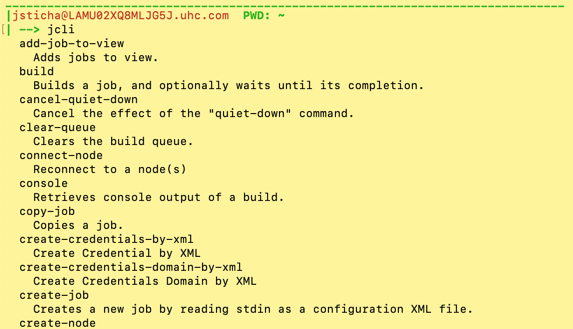

# jenkins-scripts
Handy Groovy Console Scripts for Jenkins and CloudBees Jenkins Platform

# CAUTION THE SCRIPTS CONSOLE IS VERY POWERFUL AND THUS DANGEROUS. It's recommended you backup your jenkins instance before running any scripts.

## System Requirements:
Mac Book Pro or any Linux based terminal

## Software Requirements:
Install the following tools with HomeBrew by first opening a
terminal window:
```
brew install html-xml-utils
```

## Checking out the project from Git
This project has a [submodule(s)](https://git-scm.com/book/en/v2/Git-Tools-Submodules). 
When you clone such a project, by default you get the directories that contain submodules, 
but none of the files within them yet. We will also fetch and checkout any nested submodules
as well as go into your submodules and fetch any updates for you.
Please run the commands below:
```
export githubhost=github.optum.com
git clone --recurse-submodules https://$githubhost/riptide-devops/jenkins-scripts.git && \
cd jenkins-scripts && \
git config --local include.path .gitconfig
git submodule update --init --recursive
git submodule update --remote
```
# Jenkins CLI Installation MacOS
Reference: https://www.jenkins.io/doc/book/managing/cli/#using-the-cli-client

From the cloned directory in the terminal window, we are going to run
the setup script:
```
bash ./Setup-Update_JenkinsCli.sh
```
When prompted, please provide the appropriate answers to the questions:
 - When prompted for jenkins url, please provide a url in the form:
 
        https://jenkins-riptide-devops.ocp-ctc-core-nonprod.optum.com/
        https://riptide-jenkins-cloud.optum.com/
        https://riptide-jenkins-legacy.optum.com/

## Test your installation
Open a new terminal window by pressing command-t. Then issue
the command below

```
jcli
```

The output should look something like the following if everything is working correctly:



## Troubleshooting
After running the jcli command, you may get the errors below:

Problem:
```
| --> jcli
-bash: jcli: command not found
```
Solution:
You may need to source your bash_profile
```
source ~/.zshrc
```
or open a new terminal by pressing control-t

Problem:
```
--> jcli
io.jenkins.cli.shaded.javax.websocket.DeploymentException: Handshake error.
at io.jenkins.cli.shaded.org.glassfish.tyrus.client.ClientManager$3$1.run(ClientManager.java:674)
at io.jenkins.cli.shaded.org.glassfish.tyrus.client.ClientManager$3.run(ClientManager.java:712)
...
...
```

Solution:
The URL that is passed in the Setup-Update_JenkinsCli.sh script:
```
Please enter your jenkins url. (ex. https://jenkins-riptide-devops.com/):
https://riptide-jenkins-cloud.optum.com/
```
and the token generated, are not from the same site:
```
https://jenkins-riptide-devops.ocp-ctc-core-nonprod.optum.com/user/echow1/configure
11760a9ecf6f8dab3f302bba200d7928cs
```
Re-run the Setup-Update_JenkinsCli.sh script.


# Usage

Reference: https://xanderx.com/post/run-jenkins-script-console-scripts-from-command-line-without-remoting/

Clear Build Queue

```shell
jcli groovy =< riptide/Clear_Build_Queue.groovy
```

Delete job history

```
jcli groovy =< scripts/delete_job_history.groovy <JenkinsItemName>
```

Delete artifacts from jobs

```
jcli groovy =< scripts/delete_artifacts.groovy <JenkinsItemName>
```

Delete logs from jobs
```
jcli groovy =< scripts/delete_logs.groovy <JenkinsItemName>
```

Kill Zombie Jobs

```shell
jcli groovy =< scripts/findAndKillZombieJobs.groovy
jcli groovy =< riptide/Jenkins_Abort_Jobs.groovy
jcli groovy =< riptide/Jenkins_Abort_All_Jobs.groovy
jcli groovy =< riptide/Kill_Running_Jobs.groovy
```

## Plugin Tips:

- Uninstall: [Job Configuration History Plugin](https://plugins.jenkins.io/jobConfigHistory) if you have any GitHub Org
  Jobs

## Kubernetes Debug Pod

```shell
kubectl delete -f debug-pod/debug-pod.yaml; \
  sleep 1; \
  kubectl apply -f debug-pod/debug-pod.yaml

kubectl exec --stdin --tty debug-pod -- /bin/bash
```

## Shell Script Commands: Cleanup File System

### Useful Shell Commands

Show file sizes in a directory

```bash
ls -l --block-size=M /var/lib/jenkins
```

Summary Disk Usage Recursive

```bash
du -shc /var/lib/jenkins/*
du -h --max-depth=1 /var/lib/jenkins
du -h /var/lib/jenkins/ | sort -rh | head -5
```

Shows disk space in human-readable format

```bash
df -h
```

Check Logs Directory Usage

```bash
du -ah $JENKINS_HOME/logs
```

### Cleanup Shell Commands

[Delete thousands of files quickly](https://unix.stackexchange.com/a/79656/421923)
Using rsync is surprising fast and simple.

1. make an empty dir:

```shell
mkdir -p $JENKINS_HOME/jobs/empty_dir
```

2. Rsync with --delete flag to delete files quickly:

```shell
rsync --one-file-system -avzP --itemize-changes --delete "$JENKINS_HOME/jobs/empty_dir/" "$JENKINS_HOME/jobs/Fortify_Scan/"
```

Delete .gz log files

```bash
find $JENKINS_HOME/logs \
  -name "*.gz" \
  -printf '%p' \
  -delete
```

Delete rolled logs

```bash
echo "Files to Delete:" && ls $JENKINS_HOME/logs/**/* | grep -P "^.+\.log\.\d+$"
ls $JENKINS_HOME/logs/**/* | grep -P "^.+\.log\.\d+$" | xargs -d "\n" -I {} rm -v {}
```

Delete HTML Audit Logs (One of the largest File System Hogs)

```bash
du -ah $JENKINS_HOME/logs/audit/html
ls $JENKINS_HOME/logs/audit/html | grep -P "^audit-\d{4}-\d{2}-\d{2}.html$" | xargs -d "\n" -I {} rm -v {}
du -ah $JENKINS_HOME/logs/audit/html
```

Delete Pipeline Config History

```bash
du -h -d 1 $JENKINS_HOME/pipeline-config-history
rm -rfv $JENKINS_HOME/pipeline-config-history/**/* && \
du -ah $JENKINS_HOME/pipeline-config-history
```

Delete Job Config History
[JobConfigHistory-Plugin-Best-Practices](https://support.cloudbees.com/hc/en-us/articles/115000305271-JobConfigHistory-Plugin-Best-Practices)

```bash
du -h -d 1 $JENKINS_HOME/config-history/jobs
rm -rfv $JENKINS_HOME/config-history/jobs/**/* && \
du -ah $JENKINS_HOME/config-history/jobs
```

Delete Espresso Job Log files

```bash
find -wholename "*sni-members-api-tempregression/*/log" \
  -printf '\n%p' \
  -delete
```

Disk Size of build history in a folder

```shell
du -h -d 0 $JENKINS_HOME/jobs/OpenShift_UserSync/jobs/**/builds
```
